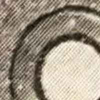
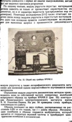

ls Compare different methods when post-processing the output from [Scantailor-Experimental](https://github.com/ImageProcessing-ElectronicPublications/scantailor-experimental).

To reprocess the shown results [get the images](1getData.sh) from [Test images for Scan Tailor](https://github.com/ImageProcessing-ElectronicPublications/scantailor-testing). [Create](2makeProj.sh) or [use](STprojects/) those ScanTailor projects and [create filtered pictures](3runStCreateFilteredImages.sh) by going to stage 6 in ScanTailor.

One demo project treats all content as an image (A) the other tries to convert text and BW-Images in BW (B). For both A and B a variant uses a scaling factor of one (A1, B1) the other a scaling factor of two (A2, B2). The project consists of 171 pages and the given size is for these 171 pages.

| What | Size | Resolution | Thumb | Text | Letters | Picture | Zoom |
|:-----|-----:|-----------:|:-----:|:----:|:-------:|:-------:|:----:|
| Original | 71'639'885 | ~1660x24503 |  |  |  |  |  |
| A1 | 1'088'240'912 | 1291x2167 |  |  |  |  |  |
| A2 | 4'106'885'020 | 2582x4334 |  |  |  |  |  |
| B1 | 35'230'916 | 1291x2167 |  |  |  |  |  |
| B2 | 121'703'962 | 2582x4334 |  |  |  |  |  |

The filtered images could be converted from tif to jpeg and there the quality could be adjusted. Also a conversion to jpeg2000 was done. A pdf could be created with ocrimg2pdfmypdf. mfbpdf could be used to create a (Mask+FG+BG).pdf which could again go throug ocrmypdf. In addition one programm was written which splits an image in black and white and color (splitBWC). The color part could be converted to a JPEG with individual compression settings. The BW part coudl be harmonized using minidjvu-mod and jbig2. Finaly the BW and color pictures are combined to a pdf using img2pdf. splitBWC and img2pdf are in development but are showing a possible way of prepocessing scaned pages.

| What | Size | OCR | Thumb | Text | Letters | Picture | Zoom | Code |
|:-----|-----:|----:|:-----:|:----:|:-------:|:-------:|:----:|:-----|
| A1 | 1'088'240'912 | No |  |  |  |  |  | |
| A1=>jpeg | 149'293'752 | No |  |  |  |  |  | [a1Jpg.sh](4postProcess/a1Jpg.sh) |
| A1=>jpeg(q=40) | 45'989'658 | No |  |  |  |  |  | [a1JpgQ40.sh](4postProcess/a1JpgQ40.sh) |
| A1=>jp2(q=40) | 63'727'248 | No |  |  |  |  |  | [a1Jp2.sh](4postProcess/a1Jp2.sh) |
| A1=>ocrmypdf | 51'003'662 | Yes |  |  |  |  |  | [a1Orcmypdf.sh](4postProcess/a1Orcmypdf.sh) |
| A1=>mfbpdf | 19'162'601 | No |  |  |  |  |  | [a1Mfbpdf.sh](4postProcess/a1Mfbpdf.sh) |
| A1=>mfbpdf=>ocrmypdf | 16'220'640 | Yes |  |  |  |  |  | [a1MfbpdfOcr.sh](4postProcess/a1MfbpdfOcr.sh) |
| | | | | | | | | |
| A2 | 4'106'885'020 | No |  |  |  |  |  | |
| A2=>jpeg | 407'846'357 | No |  |  |  |  |  | [a2Jpg.sh](4postProcess/a2Jpg.sh) |
| A2=>jpeg(q=40) | 115'767'060 | No |  |  |  |  |  | [a2JpgQ40.sh](4postProcess/a2JpgQ40.sh) |
| A1=>jp2(q=40) | 85'485'002 | No |  |  |  |  |  | [a2Jp2.sh](4postProcess/a2Jp2.sh) |
| A2=>ocrmypdf | 127'272'512 | Yes |  |  |  |  |  | [a2Orcmypdf.sh](4postProcess/a2Orcmypdf.sh) |
| A2=>mfbpdf | 61'146'148 | No |  |  |  |  |  | [a2Mfbpdf.sh](4postProcess/a2Mfbpdf.sh) |
| A2=>mfbpdf=>ocrmypdf | 48'835'245 | Yes |  |  |  |  |  | [a2MfbpdfOcr.sh](4postProcess/a2MfbpdfOcr.sh) |
| | | | | | | | | |
| B1 | 35'230'916 | No |  |  |  |  |  | |
| B1=>ocrmypdf | 8'680'026 | Yes |  |  |  |  |  | [b1Orcmypdf.sh](4postProcess/b1Orcmypdf.sh) |
| B1=>mfbpdf | 7'467'788 | No |  |  |  |  |  | [b1Mfbpdf.sh](4postProcess/b1Mfbpdf.sh) |
| B1=>mfbpdf=>ocrmypdf | 6'290'884 | Yes |  |  |  |  |  | [b1MfbpdfOcr.sh](4postProcess/b1MfbpdfOcr.sh) |
| B1=>split=>harmonize=>compress=>combine| 2'719'546 | No |  |  |  |  |  | [b1Split.sh](4postProcess/b1SplitDjvuJbig2Img.sh) |
| B1=>split=>harmonize=>compress=>combine=>ocr| 3'933'190 | Yes |  |  |  |  |  | [b1SplitOcr.sh](4postProcess/b1SplitDjvuJbig2ImgOcr.sh) |
| B1=>split=>compress=>combine| 2'954'851 | No |  |  |  |  |  | [b1SplitB.sh](4postProcess/ b1SplitJbig2Img.sh) |
| B1=>split=>compress=>combine=>OCR| 4'159'321 | Yes |  |  |  |  |  | [b1SplitBOcr.sh](4postProcess/ b1SplitJbig2ImgOcr.sh) |
| | | | | | | | | |
| B2 | 121'703'962 | No |  |  |  |  |  | |
| B2=>ocrmypdf | 17'932'000 | Yes |  |  |  |  |  | [b2Orcmypdf.sh](4postProcess/b2Orcmypdf.sh) |
| B2=>mfbpdf | 16'086'247 | No |  |  |  |  |  | [b2Mfbpdf.sh](4postProcess/b2Mfbpdf.sh) |
| B2=>mfbpdf=>ocrmypdf | 11'755'367 | Yes |  |  |  |  |  | [b2MfbpdfOcr.sh](4postProcess/b2MfbpdfOcr.sh) |
| B2=>split=>harmonize=>compress=>combine| 3'625'202 | No |  |  |  |  |  | [b2Split.sh](4postProcess/b2SplitDjvuJbig2Img.sh) |
| B2=>split=>harmonize=>compress=>combine=>Ocr| 4'871'032 | Yes |  |  |  |  |  | [b2SplitOcr.sh](4postProcess/b2SplitDjvuJbig2ImgOcr.sh) |
| B2=>split=>compress=>combine| 4'159'321 | No |  |  |  |  |  | [b2SplitB.sh](4postProcess/b2SplitDjvuJbig2Img.sh) |
| B2=>split=>compress=>combine=>Ocr| 5'304'178 | Yes |  |  |  |  |  | [b2SplitBOcr.sh](4postProcess/b2SplitDjvuJbig2ImgOcr.sh) |
