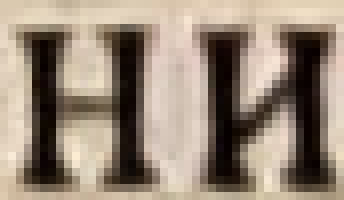
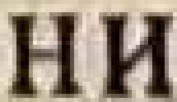
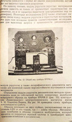
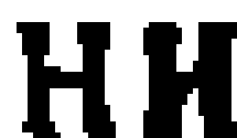
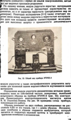
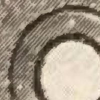

Post-processing the output from [Scantailor-Experimental](https://github.com/ImageProcessing-ElectronicPublications/scantailor-experimental).

# Create a PDF

## Only black and white pages

Go to the folder of the output images which have been processed with ScanTailor (out) and convert them to JBIG2.
```
jbig2 -p -s -t .85 -a -w .1 *.tif
```
where `-p` produces PDF ready data, `-s` is the symbol mode for texts, `-t` sets the classification threshold for symbol coder (tool low values could lead to character substitution errors. E.g. a 1 gets an I. Default is .92), `-a` uses automatic threshold in symbol encoder and `-w` sets the classification weight for symbol coder (def: 0.5).  
This will create files named `output.` followed by a 5 digit number and one called `output.sym`. The name could be changed with `-b`  
And create a pdf with:
```
jbig2topdf.py output > out.pdf
```
An optical character recognition (OCR) could be done with:
```
pipx run ocrmypdf -l deu --jobs 7 --output-type pdf out.pdf ocr.pdf
```
Where `-l` sets the language to use (`deu`..German, `frk`..German-Fraktur, `rus`..Russian, `eng`..English, `deu+eng`..German and English), `--jobs` sets the number of cores to use, `--output-type pdf` keep the pdf as it is.

[JBIG2](https://github.com/agl/jbig2enc) and [ocrmypdf](https://ocrmypdf.readthedocs.io/en/latest/index.html) are used.

## Mixture of black and white, grey and colour pages

Go to the folder of the output images which have been processed with ScanTailor (out) and split the pages in BW and colour with:
```
for fn in *.tif; do splitBWC $fn; done
```
This creates the folders `bw` and `c` and places there the black and white and grey/colour page.
The colour images are trimmed to their content:
```
# Option 1: One picture per page
for fn in ./c/*.tif; do subImages $fn; done

# Option 2: Tries to find single pictures
for fn in ./c/*.tif; do subImages $fn 1; done
```
This creates the folder `cs` and places there the cropped grey/colour page.
The grey/colour images need to be converted to JPEG:
```
# For colour pictures
mogrify -path ./cs -format jpg -quality 35 -resize 70% ./cs/*.tif

# For grey-scale pictures
mogrify -path ./cs -format jpg -colorspace Gray -quality 35 -resize 70% ./cs/*.tif
```
where `-quality` sets the compression quality (100 is highest quality) and `-resize` could be used to change the resolution of the image.  
The black and white images need to be converted to JBIG2:
```
mkdir j
jbig2 -b ./j/jb2 -p -s -t .85 -a -w .1 ./bw/*.tif
```
where `-b` sets the path and name of the resulting files, `-p` produces PDF ready data, `-s` is the symbol mode for texts, `-t` sets the classification threshold for symbol coder (tool low values could lead to character substitution errors. E.g. a 1 gets an I. Default is .92), `-a` uses automatic threshold in symbol encoder and `-w` sets the classification weight for symbol coder (def: 0.5).  
Have also a look at [jbig2enc-minidjvu](https://github.com/ImageProcessing-ElectronicPublications/jbig2enc-minidjvu/blob/main/doc/recipe.md) which shows a method to have high compression rates while keeping misclassifications low.  
Those pictures could be arranged to a pdf with:
```
# Option 1: Default page numbering (1, 2, 3, ...)
img2pdf .24 "" ./j/jb2 *.tif > out.pdf

# Option 2: Define PageLabels
img2pdf .24 "0 << /P (cover) >> 1 << /S /r >> 6 << /S /D /St 7 >>" ./j/jb2 *.tif > out.pdf
```
where the first number (here `.24`) gives the *Userunit* what defines the resolution (72/0.24 = 300dpi), the second argument could be used to define *PageLabels*, the third argument (`./j/jb2`) gives the folder there the jbig2 images could be found, the fourth argument (`*.tif`) gives the names of the original images which are used to find the color images.  
```
PageLabels:
/P The label prefix for page labels in this range
/S Numbering style 
   D Decimal Arabic numerals
   R Uppercase Roman numerals
   r Lowercase Roman numerals
   A Uppercase letters
   a Lowercase letters
/St Starting Number
```
An optical character recognition (OCR) could be done with:
```
pipx run ocrmypdf -l deu --jobs 7 --output-type pdf out.pdf ocr.pdf
```
Where `-l` sets the language to use (`deu`..German, `frk`..German-Fraktur, `rus`..Russian, `eng`..English, `deu+eng`..German and English), `--jobs` sets the number of cores to use, `--output-type pdf` keep the pdf as it is.

[ImageMagick - mogrify](https://imagemagick.org), [JBIG2](https://github.com/agl/jbig2enc), [ocrmypdf](https://ocrmypdf.readthedocs.io/en/latest/index.html) are used.  
In addition `splitBWC`, `subImages` and `img2pdf`, which can be found at [src](https://github.com/GeorgKindermann/ScanTailorPostProcess/tree/main/src) are used. If `libtiff` is installed they could be compiled with `make`. The resulting binaries could be copied to `~/.local/bin` or `/usr/local/bin`.

## Reconverting

Reconverting the resulting pdf back to something similar like the original tifs (the compression are not lossless):
```
mkdir tif
pdftoppm -r 72 -tiff -tiffcompression deflate out.pdf ./tif/p
```
[pdftoppm](https://github.com/justmoon/poppler-http/tree/master) is used.  

# Create a DJVU

## Only black and white pages

Go to the folder of the output images which have been processed with ScanTailor (out) and convert them to DJVU.
```
minidjvu *.tif out.djvu
```
An optical character recognition (OCR) could be done with:
```
pipx run ocrodjvu -e tesseract -l rus -j 7 -o ocr.djvu out.djvu
```
[minidjvu](https://minidjvu.sourceforge.net/) and [ocrodjvu](https://github.com/jwilk-archive/ocrodjvu) are used.  

## Mixture of black and white, grey and colour pages

Go to the folder of the output images which have been processed with ScanTailor (out) and split the pages in BW and colour with:
```
for fn in *.tif; do splitBWC $fn; done
```
This creates the folders `bw` and `c` and places there the black and white and grey/colour page parts.  
The grey/colour images need to be converted to JPEG:
```
mogrify -path ./c -format jpg ./c/*.tif
```
Those JPEG's are converted to c44 with:
```
for fn in ./c/*.jpg; do c44 $fn; done
```
The black and white images are converted to DJVU with:
```
minidjvu -i ./bw/*.tif index.djvu
```
The colour pictures are included with:
```
for fn in ./c/*.djvu
do
    s=${fn##*/}
    s=${s%.djvu}
    echo $s
    djvuextract $fn BG44=bg44.bg44
    djvuextract $s.djvu INCL=incl.txt Sjbz=sjbz.sjbz
    djvumake $s.djvu INCL=$(< incl.txt) Sjbz=sjbz.sjbz BG44=bg44.bg44
done
```
A single file is created with:
```
djvm -c out.djvu index.djvu
```
An optical character recognition (OCR) could be done with:
```
pipx run ocrodjvu -e tesseract -l deu -j 7 -o ocr.djvu out.djvu
```
Where `-l` sets the language to use (`deu`..German, `frk`..German-Fraktur, `rus`..Russian, `eng`..English, `deu+eng`..German and English), `-j` sets the number of cores to use and `-e` the ocr-engine.

[ImageMagick - mogrify](https://imagemagick.org), [DjVuLibre](https://djvu.sourceforge.net/), [minidjvu](https://minidjvu.sourceforge.net/) and [ocrodjvu](https://github.com/jwilk-archive/ocrodjvu) are used.  
In addition `splitBWC` and `subImages`, which can be found at [src](https://github.com/GeorgKindermann/ScanTailorPostProcess/tree/main/src) are used. If `libtiff` is installed they could be compiled with `make`. The resulting binaries could be copied to `~/.local/bin` or `/usr/local/bin`.


## Reconverting

Reconverting the resulting djvu back to something similar like the original tifs (the compression are not lossless):
```
mkdir tif
ddjvu -format=tiff out.djvu ./tif/out.tif
tiffsplit ./tif/out.tif ./tif/
```
[DjVuLibre](https://djvu.sourceforge.net/) is used.

---
I found it sometimes useful to increase the (automatically) selected content by some pixels using [xmlstarlet](https://xmlstar.sourceforge.net/) (here for the ScanTailor project file `st.ScanTailor`)
```
#Increase Content by D pixel in each direction
P0=/project/filters/select-content/page/params
P=$P0/content-box
D=2
xmlstarlet ed -u "$P0[@mode=\"auto\"]/@mode" -v manual st.ScanTailor |
    xmlstarlet ed -u "$P/top/@y" -x .-$D |
    xmlstarlet ed -u "$P/bottom/@y" -x .+$D |
    xmlstarlet ed -u "$P/left/@x" -x .-$D |
    xmlstarlet ed -u "$P/right/@x" -x .+$D |
    tail +2 > st2.ScanTailor
```
and trim the result afterwards with:
```
mogrify -trim *.tif
```

---

Compare different methods when post-processing the output from [Scantailor-Experimental](https://github.com/ImageProcessing-ElectronicPublications/scantailor-experimental).

To reprocess the shown results [get the images](1getData.sh) from [Test images for Scan Tailor](https://github.com/ImageProcessing-ElectronicPublications/scantailor-testing). [Create](2makeProj.sh) or [use](STprojects/) those ScanTailor projects and [create filtered pictures](3runStCreateFilteredImages.sh) by going to stage 6 in ScanTailor.

One demo project treats all content as an image (A) the other tries to convert text and BW-Images in BW (B). For both A and B a variant uses a scaling factor of one (A1, B1) the other a scaling factor of two (A2, B2). The project consists of 171 pages and the given size is for these 171 pages.

| What | Size | Resolution | Thumb | Text | Letters | Picture | Zoom |
|:-----|-----:|-----------:|:-----:|:----:|:-------:|:-------:|:----:|
| Original | 71'639'885 | ~1660x2450 |  |  |  |  |  |
| A1 | 1'088'240'912 | 1291x2167 |  |  |  |  |  |
| A2 | 4'106'885'020 | 2582x4334 |  |  |  |  |  |
| B1 | 35'230'916 | 1291x2167 |  |  |  |  |  |
| B2 | 121'703'962 | 2582x4334 |  |  |  |  |  |

The filtered images could be converted from tif to jpeg and there the quality could be adjusted. Also a conversion to jpeg2000 was done. A pdf could be created with ocrimg2pdfmypdf. mfbpdf could be used to create a (Mask+FG+BG).pdf which could again go through ocrmypdf. In addition one program was written which splits an image in black and white and colour (splitBWC). The colour part could be converted to a JPEG with individual compression settings. The BW part could be harmonised using minidjvu-mod and jbig2. Finally the BW and colour pictures are combined to a pdf using img2pdf. splitBWC and img2pdf are in development but are showing a possible way of prepossessing scanned pages.

| What | Size | OCR | Thumb | Text | Letters | Picture | Zoom | Code |
|:-----|-----:|----:|:-----:|:----:|:-------:|:-------:|:----:|:-----|
| A1 | 1'088'240'912 | No |  |  |  |  |  | |
| A1=>jpeg | 149'293'752 | No |  |  |  |  |  | [a1Jpg.sh](4postProcess/a1Jpg.sh) |
| A1=>jpeg(q=40) | 45'989'658 | No |  |  |  |  |  | [a1JpgQ40.sh](4postProcess/a1JpgQ40.sh) |
| A1=>jp2(q=40) | 63'727'248 | No |  |  |  |  |  | [a1Jp2.sh](4postProcess/a1Jp2.sh) |
| A1=>ocrmypdf | 51'003'662 | Yes |  |  |  |  |  | [a1Orcmypdf.sh](4postProcess/a1Orcmypdf.sh) |
| A1=>mfbpdf | 19'162'601 | No |  |  |  |  |  | [a1Mfbpdf.sh](4postProcess/a1Mfbpdf.sh) |
| A1=>mfbpdf=>ocrmypdf | 16'220'640 | Yes |  |  |  |  |  | [a1MfbpdfOcr.sh](4postProcess/a1MfbpdfOcr.sh) |
| | | | | | | | | |
| A2 | 4'106'885'020 | No |  |  |  |  |  | |
| A2=>jpeg | 407'846'357 | No |  |  |  |  |  | [a2Jpg.sh](4postProcess/a2Jpg.sh) |
| A2=>jpeg(q=40) | 115'767'060 | No |  |  |  |  |  | [a2JpgQ40.sh](4postProcess/a2JpgQ40.sh) |
| A1=>jp2(q=40) | 85'485'002 | No |  |  |  |  |  | [a2Jp2.sh](4postProcess/a2Jp2.sh) |
| A2=>ocrmypdf | 127'272'512 | Yes |  |  |  |  |  | [a2Orcmypdf.sh](4postProcess/a2Orcmypdf.sh) |
| A2=>mfbpdf | 61'146'148 | No |  |  |  |  |  | [a2Mfbpdf.sh](4postProcess/a2Mfbpdf.sh) |
| A2=>mfbpdf=>ocrmypdf | 48'835'245 | Yes |  |  |  |  |  | [a2MfbpdfOcr.sh](4postProcess/a2MfbpdfOcr.sh) |
| | | | | | | | | |
| B1 | 35'230'916 | No |  |  |  |  |  | |
| B1=>ocrmypdf | 8'680'026 | Yes |  |  |  |  |  | [b1Orcmypdf.sh](4postProcess/b1Orcmypdf.sh) |
| B1=>mfbpdf | 7'467'788 | No |  |  |  |  |  | [b1Mfbpdf.sh](4postProcess/b1Mfbpdf.sh) |
| B1=>mfbpdf=>ocrmypdf | 6'290'884 | Yes |  |  |  |  |  | [b1MfbpdfOcr.sh](4postProcess/b1MfbpdfOcr.sh) |
| B1=>split=>harmonize=><br>compress=>combine| 2'889'264 | No |  |  |  |  |  | [b1Split.sh](4postProcess/b1SplitDjvuJbig2Img.sh) |
| B1=>split=>harmonize=><br>compress=>combine=>ocr| 4'100'380 | Yes |  |  |  |  |  | [b1SplitOcr.sh](4postProcess/b1SplitDjvuJbig2ImgOcr.sh) |
| B1=>split=>compress=><br>combine| 2'948'903 | No |  |  |  |  |  | [b1SplitB.sh](4postProcess/b1SplitJbig2Img.sh) |
| B1=>split=>compress=><br>combine=>OCR| 4'156'514 | Yes |  |  |  |  |  | [b1SplitBOcr.sh](4postProcess/b1SplitJbig2ImgOcr.sh) |
| B1=>split=>Djvu| 4'593'981 | No |  |  |  |  |  | [b1SplitDjvu.sh](4postProcess/b1SplitDjvu.sh) |
| B1=>split=>Djvu=>Ocr| 5'085'714 | Yes |  |  |  |  |  | [b1SplitDjvuOcr.sh](4postProcess/b1SplitDjvuOcr.sh) |
| | | | | | | | | |
| B2 | 121'703'962 | No |  |  |  |  |  | |
| B2=>ocrmypdf | 17'932'000 | Yes |  |  |  |  |  | [b2Orcmypdf.sh](4postProcess/b2Orcmypdf.sh) |
| B2=>mfbpdf | 16'086'247 | No |  |  |  |  |  | [b2Mfbpdf.sh](4postProcess/b2Mfbpdf.sh) |
| B2=>mfbpdf=>ocrmypdf | 11'755'367 | Yes |  |  |  |  |  | [b2MfbpdfOcr.sh](4postProcess/b2MfbpdfOcr.sh) |
| B2=>split=>harmonize=><br>compress=>combine| 3'752'449 | No |  |  |  |  |  | [b2Split.sh](4postProcess/b2SplitDjvuJbig2Img.sh) |
| B2=>split=>harmonize=><br>compress=>combine=>Ocr| 4'994'891 | Yes |  |  |  |  |  | [b2SplitOcr.sh](4postProcess/b2SplitDjvuJbig2ImgOcr.sh) |
| B2=>split=>compress=><br>combine| 4'048'656 | No |  |  |  |  |  | [b2SplitB.sh](4postProcess/b2SplitDjvuJbig2Img.sh) |
| B2=>split=>compress=><br>combine=>Ocr| 5'297'867 | Yes |  |  |  |  |  | [b2SplitBOcr.sh](4postProcess/b2SplitDjvuJbig2ImgOcr.sh) |
| B2=>split=>Djvu| 10'771'448 | No |  |  |  |  |  | [b2SplitDjvu.sh](4postProcess/b2SplitDjvu.sh) |
| B2=>split=>Djvu=>Ocr| 11'318'293 | Yes |  |  |  |  |  | [b2SplitDjvuOcr.sh](4postProcess/b2SplitDjvuOcr.sh) |

Interesting that making an OCR increases the PDF about twice as mutch as the DJVU..